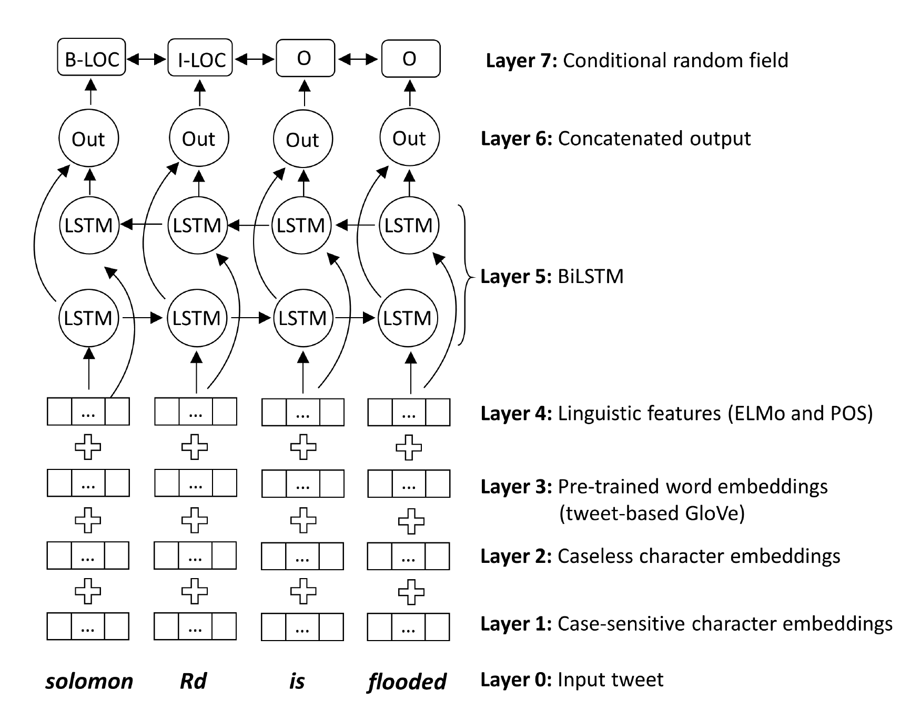

# NeuroTPR
This is Neuro-net ToPonym Recognition model for extracting locations from social media messages using deep Recurrent Neural Network. 

The goal of this model is to improve the toponym recognition performance from social media messages that have various
language irregularities, and fine-grained locations such as streets, natural landscapes, facilities, and townships.

The full paper is available at: [NeuroTPR: A Neuro-net ToPonym Recognition Model for Extracting Locations from Social Media Messages](https://geoai.geog.buffalo.edu/publications/)

### NeuroTPR architecture

<p align="center">

</p>

### Dataset

* [WNUT-2017](https://github.com/leondz/emerging_entities_17) as default training dataset

* A large geo-annotated dataset based on Wikipedia articles (See dataset construction details in WikiDataHelper)

* 50 place-related tweets selected from Hurricane Harvey Twitter Dataset

* All datasets are converted into the same format as WNUT-2017


### NeuroTPR training

```bash
    python3 Model/add_lin_features.py
    python3 Model/train.py
 ```

### NeuroTPR prediction on batch

```bash
    python3 Model/add_lin_features_test.py
    python3 Model/geoparsing.py
 ```

### Performance evaluation

* Testing dataset: 1,000 tweets selected from Hurricane Harvey Twitter Dataset

We test NeuroTPR and three baseline rule-based toponym recognizers using the benchmarking platform [EUPEG](https://github.com/geoai-lab/EUPEG). The performance is presented in the table below:

|   Corpora   |  Precision |  Recall |	F_score |
|-------------|:----------:|--------:|---------:|
| HarveyTweet |  	0.755  |  0.695  |	0.724	|
|  GeoCorpora |    0.817   |   0.745 |	0.799	|
|    Ju2016   | 	-	   |   0.636 |	  - 	|
