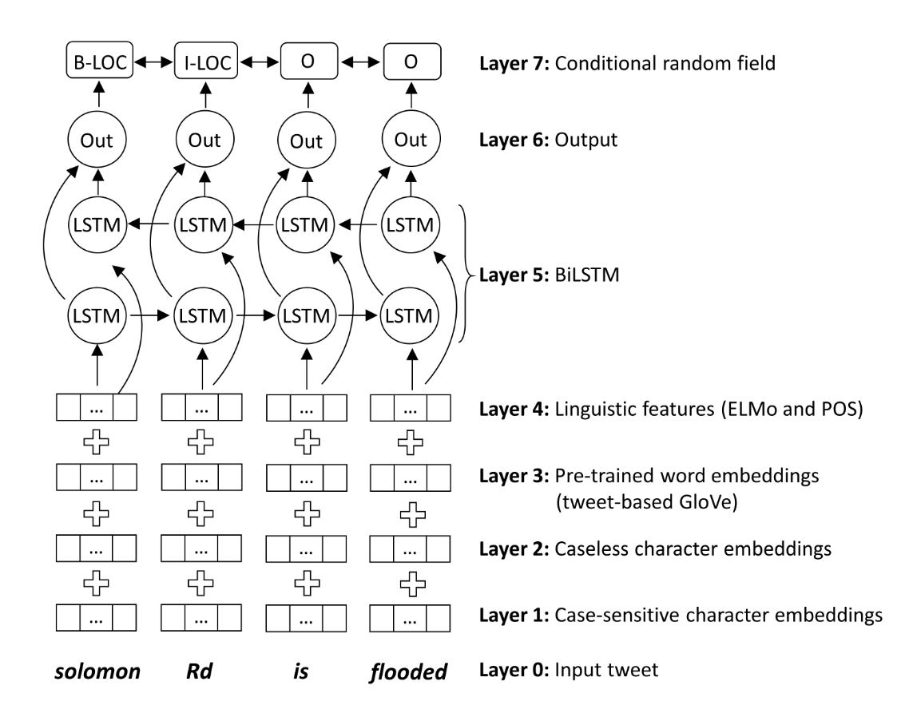

# NeuroTPR


### Overall description

NeuroTPR is a toponym recognition model designed for extracting locations from social media messages. It is based on a general Bidirectional Long Short-Term Memory network (BiLSTM) with a number of additional features, such as double layers of character embeddings, GloVe word embeddings, and contextualized word embeddings ELMo.

The goal of this model is to improve the accuracy of toponym recognition from social media messages that have various language irregularities, such as informal sentence structures, inconsistent upper and lower cases (e.g., “there is a HUGE fire near camino and springbrook rd”), name abbreviations (e.g., “bsu” for “Boise State University”), and misspellings. We tested NeuroTPR in the application context of disaster response based on a dataset of tweets from Hurricane Harvey in 2017.

More details can be found in our paper: [Wang, J., Hu, Y., & Joseph, K. (2020): NeuroTPR: A Neuro-net ToPonym Recognition model for extracting locations from social media messages. Transactions in GIS, 24(3), 719-735.](http://www.acsu.buffalo.edu/~yhu42/papers/2020_TGIS_NeuroTPR.pdf)

<p align="center">

<br />
Figure 1. The overall architecture of NeuroTPR
</p>


### Repository organization

* "Data" folder: This folder has two subfolders, "TrainingData" and "TestData". The "TrainingData" folder contains two training datasets, namely "Wikipedia3000" and "WNUT2017". "Wikipedia3000" was automatically constructed from 3000 Wikipedia articles using our proposed workflow (source code is in the folder "WikiDataHelper" under the "SourceCode" folder). "WNUT2017" contains 599 tweets selected from [the original dataset](https://github.com/leondz/emerging_entities_17). The "TestData" folder contains 1,000 human-annotated tweets from Hurricane Harvey 2017. These tweets are from the [Hurricane Harvey Twitter Dataset](https://digital.library.unt.edu/ark:/67531/metadc993940/). Other two test datasets used in the paper can be obtained from existing repositories: GeoCorpora can be downloaded from the [GeoCorpora Project](https://github.com/geovista/GeoCorpora), and Ju2016 is available at the [EUPEG project](https://github.com/geoai-lab/EUPEG/tree/master/corpora/Ju2016).

* "SourceCode" folder: This folder has two subfolders, "neurotpr" and "WikiDataHelper". The "neurotpr" folder contains the source code for training and using NeuroTPR. The "neurotpr" folder is a Python package that can be directly included and imported in your Python project. The "WikiDataHelper" folder contains the source code for building up an annotated dataset from Wikipedia.

* "PretrainedModel" folder: This folder contains the files of the pertained NeuroTPR model. The "PretrainedModel.zip" is simply a zip file of this folder to make the download of the pertained model easier.


### Use the pretrained NeuroTPR model 

Using the pretrained NeuroTPR model for toponym recognition will need the following steps:

1. Setup the virtual environment: Please create a new virtual environment using Anaconda and install the dependent packages using the following commands (please run them in the same order below):
 ```bash
	conda create -n NeuroTPR python=3.6
	conda activate NeuroTPR
	conda install keras -c conda-forge
	pip install git+https://www.github.com/keras-team/keras-contrib.git
	pip install neurotpr
 ```

2. Download the [pretrained model](PretrainedModel.zip), and unzip it to a folder that you would prefer.

3. Use NeuroTPR to recognize toponyms from text. A snippet of example code is below:
 ```bash
from neurotpr import geoparse
    
geoparse.load_model("the folder path of the pretrained model; note that the path should end with /")
result = geoparse.topo_recog("Buffalo is a city in New York State.")
print(result)
 ```
The input of the "topo_recog" function is a string, and the output is a list of JSON objects containing the recognized toponyms and their start and end indexes in the input string.


### Combine NeuroTPR with a geolocation service
NeuroTPR is a toponym recognition model, which means that it will not assign geographic coordinates to the recognized toponyms. If you would like to add coordinates to the recognized toponyms, you could use the [geocoding function from GeoPandas](https://geopandas.org/geocoding.html), [Google Place API](https://developers.google.com/maps/documentation/javascript/places), or other services. Note that these services are not doing place name disambiguation for you, since they don't know the contexts under which these toponyms are mentioned. However, it would be fine to use one of these services if the toponyms in your text are not highly ambiguous.


### Retrain NeuroTPR using your own data

Retraining NeuroTPR using your own data will be more complicated. You first need to add POS features to your own annotated dataset in CoNLL2003 format (you can check our shared training data for an example of the format). You can then use the following Python code to add POS features via the NLTK library.

```bash
    python3 SourceCode/neurotpr/add_lin_features.py
```

To train NeuroTPR, you need to:
* Set up the file path to load your word embeddings and training data;
* Set up the file path to save the trained model;
* Train the model using the following command:
```bash
    python3 SourceCode/neurotpr/train.py
 ```
More details about training NeuroTPR are available in the comments of the source code files shared in this repository. 


### Project dependencies:
* Python 3.6
* Keras 2.3.1
* Tensorflow 1.14.0
* Keras-contrib (https://github.com/keras-team/keras-contrib)
* Tensorflow Hub (https://www.tensorflow.org/hub)
* NLTK 3.5
* emoji 0.6.0
