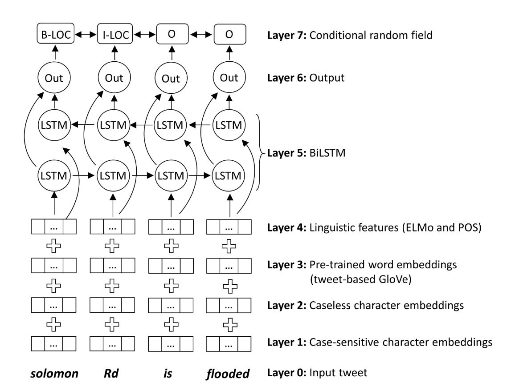

# NeuroTPR


### Overall description

NeuroTPR is a toponym recognition model designed for extracting locations from social media messages. It is based on a general Bidirectional Long Short-Term Memory network (BiLSTM) with a number of additional features, such as double layers of character embeddings, GloVe word embeddings, and contextualized word embeddings ELMo.

The goal of this model is to improve the accuracy of toponym recognition from social media messages that have various
language irregularities, such as informal sentence structures, inconsistent upper and lower cases (e.g., “there is a HUGE fire near camino and springbrook rd”), name abbreviations (e.g., “bsu” for “Boise State University”), and misspellings. Particularly, NeuroTPR is designed to extract fine-grained locations such as streets, natural features, facilities, point of interest (POIs), and administrative units. We tested NeuroTPR in the application context of disaster response based on a dataset of tweets from Hurricane Harvey in 2017.

More details can be found in our paper: [Wang, J., Hu, Y., & Joseph, K. (2020): NeuroTPR: A Neuro-net ToPonym Recognition model for extracting locations from social media messages. Transactions in GIS, accepted.](https://geoai.geog.buffalo.edu/publications/)

<p align="center">

<br />
Figure 1. The overall architecture of NeuroTPR
</p>


### Repository organization

* "HarveyTweet" folder: This folder contains the Harvey2017 dataset with 1,000 human-annotated tweets.
* "Model" folder: This folder contains the Python source codes for using the trained NeuroTPR model or retraining NeuroTPR using your own data.
* "WikiDataHelper" folder: This folder contains the Python source codes to build up an annotated dataset from Wikipedia for training NeuroTPR.
* "training_data" folder: This folder contains three training data sets (Wikipedia3000, WNUT2017, and 50 optional tweets from Hurricane Harvey) used for training NeuroTPR. Wikipedia3000 was automatically constructed from 3000 Wikipedia articles using our proposed workflow (more details can be found in the folder "WikiDataHelper"); WNUT2017 contains 599 tweets selected from [the original dataset](https://github.com/leondz/emerging_entities_17); and 50 optional tweets contain 50 crisis-related tweets from the [Hurricane Harvey Twitter Dataset](https://digital.library.unt.edu/ark:/67531/metadc993940/) with door number addresses or street names.


### Test datasets and model performance
NeuroTPR was tested on three different datasets, which are:
* HarveyTweet: 1,000 human-annotated tweets from 2017 Hurricane Harvey. This dataset is available in the "HarveyTweet" folder.
* GeoCorproa:  1,689 human-annotated tweets from the [GeoCorpora Project](https://github.com/geovista/GeoCorpora).
* Ju2016: 5,000 short sentences collected from Web pages and automatically annotated. This dataset is  available at the [EUPEG project](https://github.com/geoai-lab/EUPEG/tree/master/corpora/Ju2016).

We tested NeuroTPR using the benchmarking platform [EUPEG](https://github.com/geoai-lab/EUPEG). The performance of NeuroTPR on the three datasets is presented in the table below:

|   Corpora   |  Precision |   Recall  |   F_score  |
|-------------|:----------:|----------:|-----------:|
| HarveyTweet |    0.787   |   0.678   |	0.728	|
|  GeoCorpora |    0.800   |   0.761   |	0.780	|
|    Ju2016   | 	 -	   |   0.821   |	  - 	|


### Use the trained NeuroTPR for toponym recognition

The following python codes provide an example of using the trained NeuroTPR model to recognize toponyms from texts.

Input: Tokenized texts saved in the CoNLL2003 format

```bash
    python3 Model/geoparsing.py
 ```
Output: toponym-name1,,statr-index,,end-index||toponym-name2,,statr-index,,end-index||...


### Retrain NeuroTPR using your own data

If you wish to re-train NeuroTPR using your own data, you first need to add POS features to your own annoated dataset in CoNLL2003 format. You can use the following python codes to add POS features via NLTK tool.

```bash
    python3 Model/add_lin_features.py
```

To train NeuroTPR, you need to:
* Set up the file path to load word embeddings and training data;
* Set up the file path to save the trained model;
* Tune the key hyper-parameters of the NeuroTPR

```bash
    python3 Model/train.py
 ```

Please see detailed comments in our source codes for changing the settings.


### Project dependencies:

* Python 3.6+ and a recent version of numpy
* Keras 2.3.0
* Tensorflow 1.8.0+
* Keras-contrib (https://github.com/keras-team/keras-contrib)
* Tensorflow Hub (https://www.tensorflow.org/hub)
* The rest should be installed alongside the four major libraries
